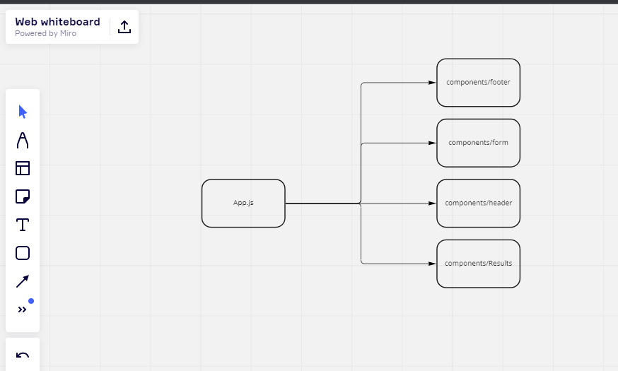

# Resty
Practicing on creating a react app that handles api requests 

## Base stage :
> Started the app and made the visuals 

## State Stage : 
> added the functionality and made use of the useState and did an overhall to the styling in general 
## UML DIAGRAM

## Links
[PR for base branch](https://github.com/Mohammed-Awadallah/resty/pull/2)
[PR for state branch](https://github.com/Mohammed-Awadallah/resty/pull/5)
